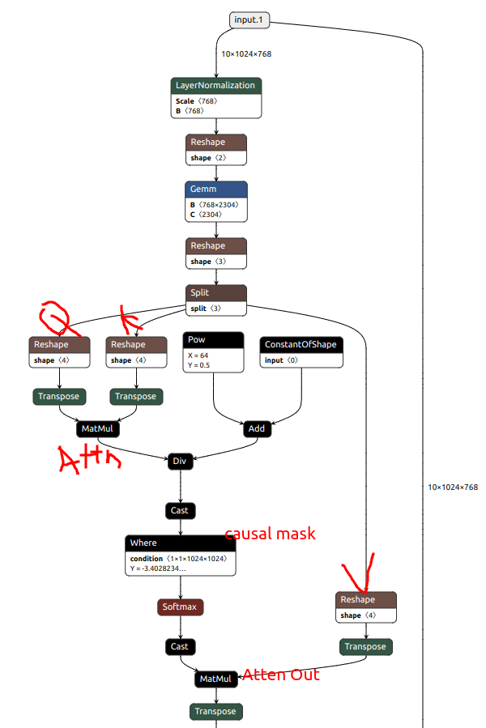
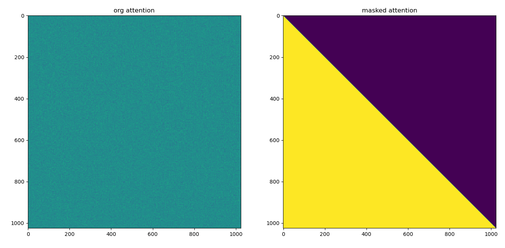
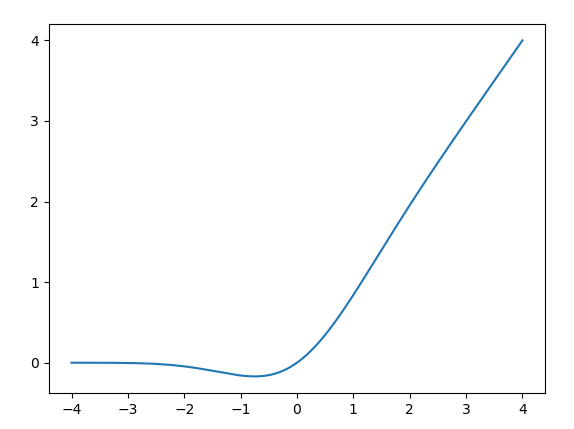

# 一、GTP2Block 整体结构
## 1.1 block准备
```python
import torch 
from torch import nn
from transformers import GPT2Model, GPT2Config
from transformers.models.gpt2.modeling_gpt2 import GPT2Block

cfg = GPT2Config()
print(cfg.add_cross_attention)
blk = GPT2Block(cfg, layer_idx=0)
hidden_states = torch.randn(10, 1024, 768)
```

## 1.2 block架构
经典的preNorm TFDecoder架构
```python
GPT2Block(
  (ln_1): LayerNorm((768,), eps=1e-05, elementwise_affine=True)
  (attn): GPT2Attention(
    (c_attn): Conv1D()
    (c_proj): Conv1D()
    (attn_dropout): Dropout(p=0.1, inplace=False)
    (resid_dropout): Dropout(p=0.1, inplace=False)
  )
  (ln_2): LayerNorm((768,), eps=1e-05, elementwise_affine=True)
  (mlp): GPT2MLP(
    (c_fc): Conv1D()
    (c_proj): Conv1D()
    (act): NewGELUActivation()
    (dropout): Dropout(p=0.1, inplace=False)
  )
)
```

## 1.3 forward-preNorm

```python
y = attn(ln_1(x)) + x
O = mlp(ln_2(y)) + y
```
[pic-补充 Netron 截图+解释]



# 二、GPT2Attention

1. hidden 拆分成 q k v: `query, key, value = gpt2_att.c_attn(hidden_states).split(split_size, dim=2)`
2. q k v 拆分成多头
```python
query = gpt2_att._split_heads(query, gpt2_att.num_heads, gpt2_att.head_dim)
key = gpt2_att._split_heads(key, gpt2_att.num_heads, gpt2_att.head_dim)
value = gpt2_att._split_heads(value, gpt2_att.num_heads, gpt2_att.head_dim)
print(f'{query.shape=}') # [batch, n_head, len, head_emb] 
```
3. 计算attention
   1. $\hat{A}=\frac{QK^T}{\sqrt{K_{dim}}}$ 代码中用的是$\sqrt{V_{dim}}$
   2. <font color=darkred>casual attention: 对原始attn进行mask</font>
   3. 计算mask后的attention: $A=softmax(\hat{A}, dim=-1)$
   4. $O=AV$
```python
# 3- attention 
#  3.1 A = QK^T
attn_weights = torch.matmul(query, key.transpose(-1, -2)) / torch.full([], value.size(-1) ** 0.5)
#  3.2 mask 
max_positions = 1024
causal_mask = torch.tril(
    torch.ones((max_positions, max_positions), dtype=torch.bool)
).view(1, 1, max_positions, max_positions)
mask_value = torch.finfo(attn_weights.dtype).min
mask_value = torch.full([], mask_value, dtype=attn_weights.dtype).to(attn_weights.device)
# where mask
attn_weights = torch.where(causal_mask, attn_weights.to(attn_weights.dtype), mask_value)
#  3.3 A = softmax(A)
attn_weights = nn.functional.softmax(attn_weights, dim=-1) # [batch, n_head, len, len] 
#  3.4  O = AV
attn_output = torch.matmul(attn_weights, value)            # [batch, n_head, len, head_emb] 
# 4- q k v -> merge head -> attn_out # [batch, len, head_emb*n_head] 
attn_output = gpt2_att._merge_heads(attn_output, gpt2_att.num_heads, gpt2_att.head_dim)
```
4. 多头合并 `[batch, n_head, len, head_emb]  =>>  [batch, len, head_emb*n_head] `
   1. `attn_output = gpt2_att._merge_heads(attn_output, gpt2_att.num_heads, gpt2_att.head_dim)`




# 三、GPT2MLP

结构比较简单$O=dropOut(\sigma (XW_1)W_2)$，主要是激活函数 
```python
GPT2MLP(
  (c_fc): Conv1D()
  (c_proj): Conv1D()
  (act): NewGELUActivation()
  (dropout): Dropout(p=0.1, inplace=False)
)

class NewGELUActivation(nn.Module):
    """
    Implementation of the GELU activation function currently in Google BERT repo (identical to OpenAI GPT). Also see
    the Gaussian Error Linear Units paper: https://arxiv.org/abs/1606.08415
    """

    def forward(self, input: Tensor) -> Tensor:
        return 0.5 * input * (1.0 + torch.tanh(math.sqrt(2.0 / math.pi) * (input + 0.044715 * torch.pow(input, 3.0))))
```

NewGELUActivation 它是高斯误差线性单元（Gaussian Error Linear Unit，简称 GELU）的一种变体。GELU 激活函数在近年来的深度学习模型中越来越受欢迎，尤其是在自然语言处理（NLP）领域，如 BERT 和 GPT 等模型中。

GELU 激活函数的数学定义是输入值 x 乘以标准正态分布的累积分布函数（CDF）在该点的值。具体来说，GELU 的表达式为：
$$GELU(x)=x \Phi(x)$$

其中$\Phi(x)$ 是标准正态分布的 CDF，可以通过误差函数（error function，记为 erf）来计算：
$$\Phi(x)=\frac{1}{2}(1+erf(\frac{x}{\sqrt 2}))$$
GPT2中用了近似公式：
$$\sigma(x) = 0.5x [1+ tanh(\sqrt{\frac{2}{\pi}} (x + 0.044715 x^3))]$$

GELU 激活函数的优点包括：
- 平滑性：GELU 在整个实数域上都是平滑的，这有助于梯度的传播，**减少了梯度消失或爆炸的问题**。
- 非单调性：GELU 函数是非单调的，**这意味着它能够捕捉数据中的更复杂模式**。
- 改善性能：在某些任务中，使用 GELU 激活函数的模型性能优于使用传统的 ReLU 或其他激活函数的模型。
